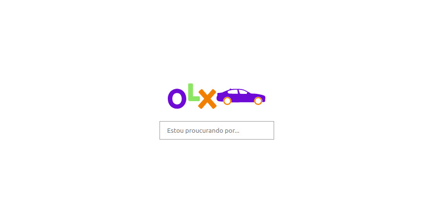
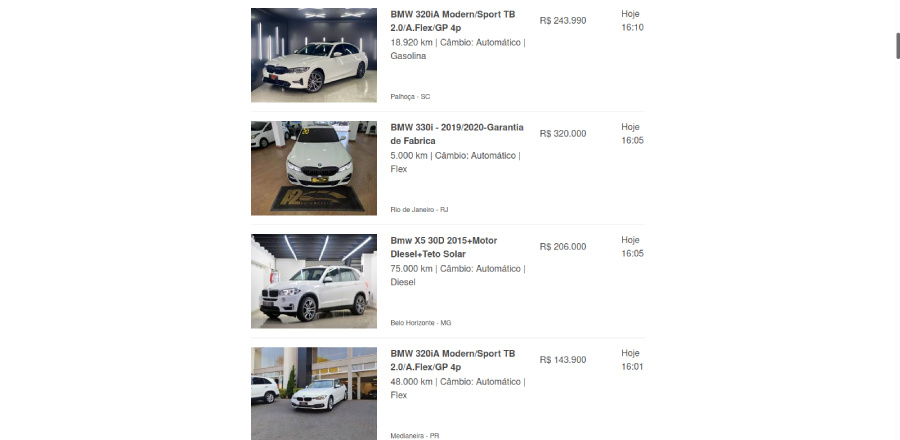

<p align="center">
  </img>
</p>

<p align="center" style="margin: 50px">
  <a href="https://github.com/gcairesdev/olx-crawler">
    </img>
  </a>
  <a href="https://github.com/gcairesdev/olx-crawler/blob/master/LICENSE.md">
    </img>
  </a>
  <a href="https://github.com/gcairesdev/olx-crawler">
    </img>
  </a>
</p>

# Índice

* [Sobre o projeto](#Olx-crawler)
  * [Feito com](#feito-com)
  * [Objetivo](#objetivo)
  * [Justificativa](#justificativa)
* [Iniciando](#iniciando)
  * [Pré requisitos](#pré-requisitos)
  * [Instalação](#instalação)
* [Contribuindo](#contribuindo)
* [Autor](#autor)
* [Licença](#licença)

## Olx crawler
> Pesquise veículos na Olx através de um Crawler.

Busca de veículos no site da Olx com armazenamento em cache para próximas pesquisas.

<p align="center">
  </img>
</p>

<p align="center">
  </img>
</p>

## Feito com
* [PHP](https://www.php.net/)
* [Laravel](https://laravel.com/)

## Objetivo

Fazer um crawler para extrair informações de algum site.

## Justificativa

Desafio para vaga de emprego.

## Iniciando

Para iniciar, veja os pré requisitos do projeto.

## Pré requisitos
* [Git](https://git-scm.com/)
* [Docker](https://docker.com) (com [compose](https://docs.docker.com/compose/install/))
* Linux ou [WSL2](https://docs.microsoft.com/pt-br/windows/wsl/install-win10) (Windows Subsystem for Linux)

## Instalação

Clone o repositório:

```sh
git clone https://github.com/gcairesdev/olx-crawler
```

Navegue à pasta do projeto:

```sh
cd olx-crawler
```

Suba o container do docker:

```sh
docker-compose up -d
```

Abra o link em seu navegador: http://127.0.0.1:8000/

## Autor

|                |                  |          |            |         |
|----------------|------------------|----------|------------|---------|
| ![][githubImg] | Guilherme Caires | [Github] | [Linkedin] | [Email] |

## Contribuindo

Confira a página [CONTRIBUTING](./CONTRIBUTING.md) para ver os melhores locais para arquivar problemas, iniciar discussões e começar a contribuir.

## Licença

Lançado em 2021.
Este projeto está sob a [Licença MIT](./LICENSE.md).

---

<p align="center">
    Feito com :heart: por <a href="https://github.com/gcairesdev">Guilherme Caires</a>
</p>

<!-- Markdown link & img dfn's -->
[Github]: https://github.com/gcairesdev
[GithubImg]: https://avatars.githubusercontent.com/u/54117888?s=100
[Linkedin]: https://linkedin.com/in/guilherme-caires/
[Email]: contatogcaires@gmail.com